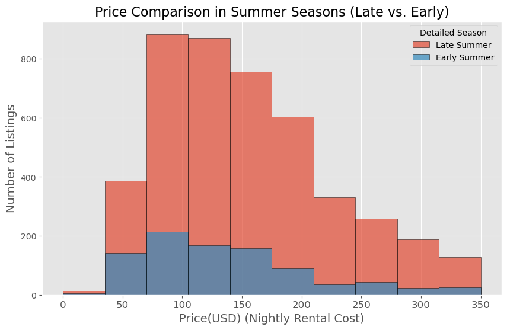
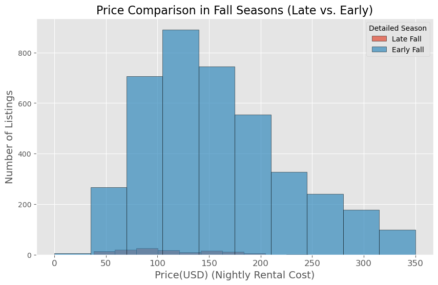
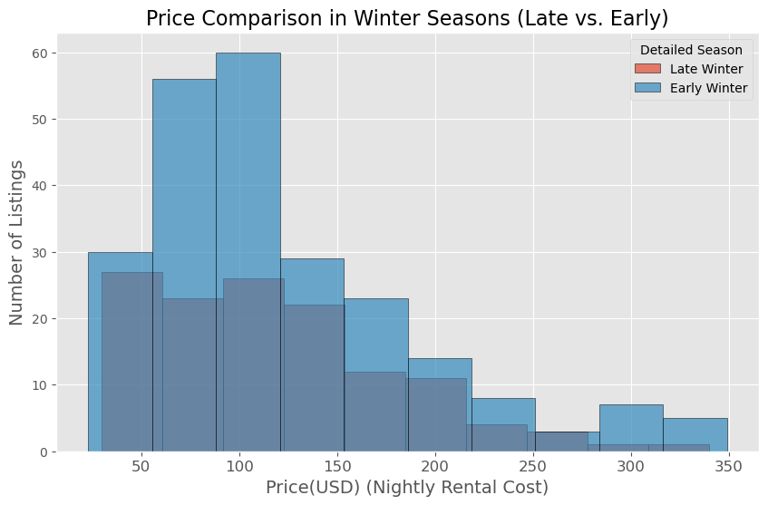
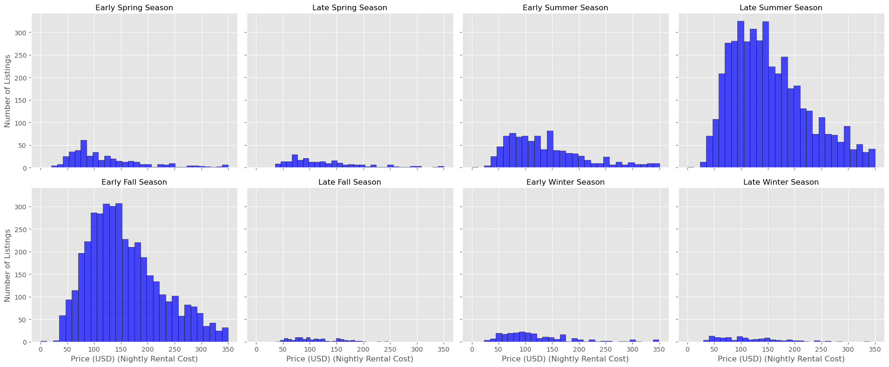

Certainly! Here’s the updated README with the old histogram omitted:

---

# Analyzing Seasonal Trends and Their Impact on Airbnb Prices

### Executive Summary
This project examines the impact of seasonal trends on Airbnb listings, focusing on metrics such as price, number of reviews, reviews per month, and availability. Significant seasonal variations were found, with prices peaking in Late Summer and guest activity highest in Late Summer and Early Fall. These insights can help optimize pricing strategies and booking decisions for both hosts and guests.

### Team Members
Bryan, Nebiat, Jazmin

### Project Description/Outline
We analyzed how seasonal trends affect various Airbnb metrics, such as price, number of reviews, reviews per month, and availability. The project identifies patterns and trends that inform hosts and potential guests about optimal times to rent or stay at an Airbnb property.

### Research Questions
1. How do average nightly rental prices vary by season?
2. How do the number of reviews, reviews per month, and availability change with the seasons?
3. What is the correlation between average nightly rental prices and other metrics across different seasons?

### Major Findings and Implications

**1. Seasonal Price Comparison**

- **Spring (Early vs. Late)**
  - Prices are generally lower in Early Spring compared to Late Spring, with most listings priced between $50-$150.
  - 

- **Summer (Early vs. Late)**
  - Prices peak in Late Summer, with most listings priced between $100-$200, reflecting high demand.
  - 

- **Fall (Early vs. Late)**
  - Prices are consistent between Early and Late Fall, with most listings in the $100-$200 range, suggesting steady demand.
  - 

- **Winter (Early vs. Late)**
  - Winter shows the least price variability, with most listings priced between $100-$150.
  - 

**2. Price Distribution by Season**

- The faceted histogram allows for a clear comparison of how nightly rental prices are distributed across different seasons. Late Summer shows the highest concentration of listings in the $100 to $200 range, confirming it as a peak season, while Early Spring and Winter show broader distributions with lower price points.
  - 

**3. Number of Reviews and Price by Season**

- Guest activity peaks in Late Summer, corresponding with the highest prices, indicating that demand drives both pricing and reviews.
  - **Implications for Hosts**: Focus on gathering reviews during peak seasons to enhance property visibility.
  - **Implications for Guests**: Booking during off-peak seasons may offer better deals.
  - 

**4. Reviews per Month and Price by Season**

- Reviews per month peak in Early Fall, reflecting feedback from high guest activity in Late Summer.
  - **Implications for Hosts**: Use Early Fall reviews to improve service for subsequent seasons.
  - **Implications for Guests**: Leverage the increased reviews in Early Fall for informed booking decisions.
  - 

**5. Box and Whiskers Plot of Average Prices by Season**

- Prices are most variable during summer, indicating peak season with a wide range of listing prices. Winter shows lower, more consistent pricing.
  - **Implications for Hosts**: Use summer pricing variability to set competitive rates.
  - **Implications for Guests**: Consider booking early in summer to avoid price surges.
  - 

### ANOVA Test Results
**Statistical Analysis**:
- **Price**: F-value = 42.14, P-value = 5.22e-59 (significant).
- **Number of Reviews**: F-value = 22.15, P-value = 5.99e-30 (significant).
- **Reviews per Month**: F-value = 78.04, P-value = 7.71e-111 (significant).
- **Availability**: F-value = 24.05, P-value = 1.07e-32 (significant).

**Conclusion**: All results indicate significant seasonal variations in Airbnb metrics, particularly in pricing and guest activity.

### Recommendations
- **For Hosts**: Adjust pricing and manage availability seasonally; encourage year-round reviews for optimal visibility and revenue.
- **For Guests**: Book during off-peak seasons for better deals and availability; contribute reviews to the community.

### Data Processing and Filtering
To maintain focus on typical Airbnb listings, properties priced above $350 per night were excluded due to significant outliers.

### Limitations
- **Date Issues**: Limited date availability restricted year-round stay analysis.
- **Price Outliers**: The analysis focused on listings priced $350 or below to maintain data relevance.

---

This version eliminates the old histogram and provides a streamlined analysis.
